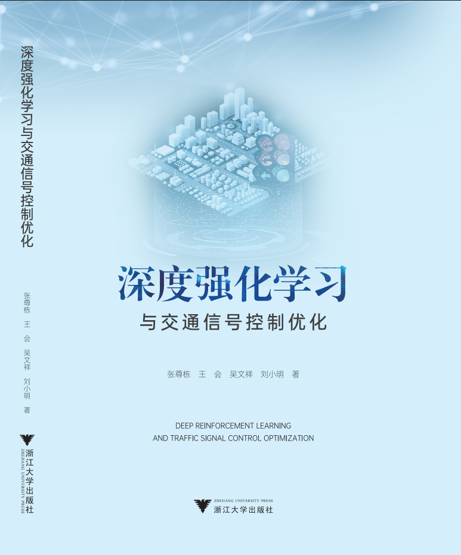

# 北方工业大学 人工智能实验室

北方工业大学人工智能实验室

## 演化博弈

## 多Agent强化学习(MARL)

## [Sumo交通仿真](https://gitee.com/itsncut/trafficsimulation)

## [《深度强化学习与道路交通控制优化》](marlintraficcontroloptimization.md)
[书中的全部源代码](marlintraficcontroloptimization.md)


```latex
@book{drlatsco2024,
    title     = "深度强化学习与交通信号控制优化",
    author    = "张尊栋 and 王会 and 吴文祥 and 刘小明",
    year      = 2024,
    publisher = "浙江大学出版社",
    address   = "杭州",
    isbn      = "978-7-308-25175-4"
}
```


## [VSCODE+LATEX](vscode+LaTeX.md)
