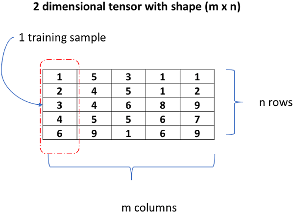
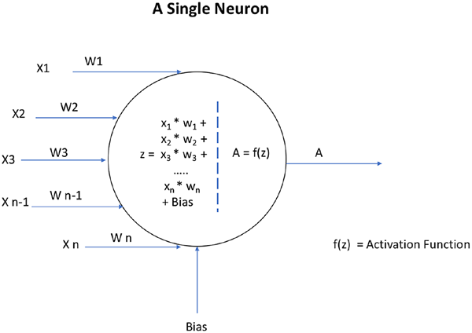
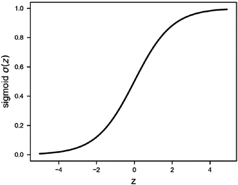
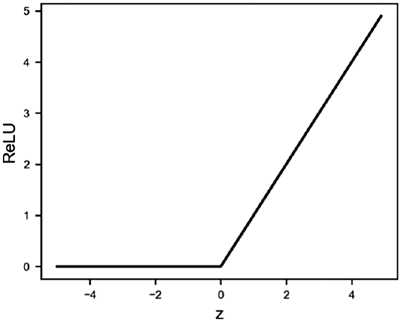
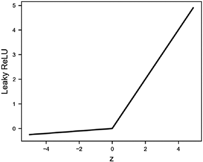
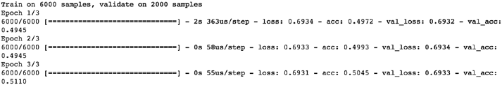

# 深度学习 in Keras

## 1. Input Data



 Essentially,  the model understands data as “tensors”. Tensors are nothing but a generic form for vectors, or in computer engineering terms, a simple n-dimensional matrix. Data of any form is finally represented as a homogeneous numeric matrix. So, if the data is tabular, it will be a two dimensional tensor where each column represents one training sample  and the entire table/matrix will be m samples. Additionally, DL models can interpret only numeric data. Image data also needs to be transformed into an n-dimensional tensor. 

An image is stored in data as a three-dimensional tensor where two dimensions define the pixel values on a 2D plane and a third dimension defines the values for RGB color channels. So essentially, one image becomes a three-dimensional tensor and n images will be a four-dimensional tensor, where the fourth dimension will stack a 3D tensor image as a training sample. 

Lastly, it is a good practice to normalize, standardize, or scale the input values before training. Normalizing the values will bring all values in the input tensor into a 0–1 range, and standardization will bring the values into a range where the mean is 0 and the standard deviation is 1. This helps to reduce computation, as the learning improves by a great margin and so does performance, as the activation functions (covered in the following) behave more appropriately.

## 2. Neuron



## 3. Activation Function

There are several problems here. Firstly, the range of the output value would be -Infinity to + Infinity, where we won’t have a clear way of defining a threshold where activation should happen. Secondly, the network will in a way be rendered useless, as it won’t really learn. This is where a bit of calculus and derivatives come into the picture. To simplify the story, we can say that if your activation function is a linear function (basically no activation), then the derivative of that function becomes 0; this becomes a big issue because training with the backpropagation algorithm helps give feedback to the network about wrong classifications and thereby helps a neuron to adjust its weights by using a derivative of the function. If that becomes 0, the network loses out on this learning ability. 

 To put it another way, we can say there is really no point of having the DNN, as the output of having just one layer would be similar to having n layers. To keep things simple, we would always need a nonlinear activation function (at least in all hidden layers) to get the network to learn properly. There are a variety of choices available to use as an activation function. The most common ones are the sigmoid function and the ReLU (rectified linear unit)

### 3.1. Sigmoid Activation Function

A sigmoid function is defined as 
$$
\sigma(z)=\frac{1}{(1+e^{-z})}
$$
, which renders the output between 0 and 1 as shown in the following illustration. 



### 3.2. ReLU Activation Function

Similarly, the ReLU uses the function 
$$
f(z) = \max(0,z)
$$
, which means that if the output is positive it would output the same value, otherwise it would output 0.

 

 The function may look linear, but it isn’t. ReLU is a valid nonlinear function and in fact works really well as an activation function. It not only improves the performance but significantly helps the number of computations to be reduced during the training phase. This is a direct result of the 0 value in the utput when z is negative, thereby deactivating the neuron.

But because of the horizontal line with 0 as the output, we can face serious issues sometimes. For instance, in the previous section we discussed a horizontal line, which is a constant with a derivative of 0 and therefore may become a bottleneck during training, as the weights will not easily get updated. To circumvent the problem, there was a new activation function proposed: Leaky ReLU, where the negative value outputs a slightly slanting line instead of a horizontal line, which helps in updating the weights through backpropagation effectively. 

Leaky ReLU is defined as
$$
\begin{cases}
f(z)=z;	& \text{when $z>0$}\\
f(z)=\propto z;	& \text{when $z<0$ and where $\propto$ is a parameter that is defined as a small constant, say 0.005}
\end{cases}
$$


## 4. Model

The easiest way to define a model is by using the sequential model, which allows easy creation of a linear stack of layers.

The following example showcases the creation of a simple sequential model with one layer followed by an activation. The layer would have 10 neurons and would receive an input with 15 neurons and be activated with the ReLU activation function.

```python
from keras.models import Sequential
from keras.layers import Dense, Activation
model = Sequential()
model.add(Dense(10, input_dim=15))
model.add(Activation('relu'))
```

## 5. Layers

A layer in the DNN is defined as a group of neurons or a logically separated group in a hierarchical network structure.

### 5.1. Core Layers

#### 5.1.1. Dense Layer

A dense layer is a regular DNN layer that connects every neuron in the defined layer to every neuron in the previous layer.  Since it accommodates every possible connection between the layers, it is called a “dense” layer.

```python
keras.layers.Dense(units, activation=None, use_bias=True,
                     kernel_initializer='glorot_uniform',
                     bias_initializer='zeros',
                     kernel_regularizer=None,
                     bias_regularizer=None,
                     activity_regularizer=None,
                     kernel_constraint=None,
                     bias_constraint=None)
```

 We can specify the number of units (i.e., neurons for the layer), the activation type, the type initialization for kernel and bias, and other constraints. Most often, we just use parameters like units and activation. The rest can be left to the defaults for simplicity.

We also need to define the input shape for the Keras layer. The input shape needs to be defined for only the first layer. Subsequent layers just need the number of neurons defined. We can use the *input_dim* attribute to define how many dimensions the input has. 

 For instance, if we have a table with 10 features and 1000 samples, we need to provide the input_dim as 10 for the layer to understand the shape of input data.

**Example**: A network with one hidden layer and the output layer for simple binary classification.

Layer 1 has 5 neurons and expects an input with 10 features; therefore, input_dim =10. The final layer is the output, which has one neuron.

```python
model = Sequential()
model.add(Dense(5,input_dim=10,activation = "sigmoid"))
model.add(Dense(1,activation = "sigmoid"))
```

### 5.2. Dropout Layer

The dropout layer in DL helps reduce overfitting by introducing regularization and generalization capabilities into the model. In the literal sense, the dropout layer drops out a few neurons or sets them to 0 and reduces computation in the training process. The process of arbitrarily dropping neurons works quite well in reducing overfitting. 

```python
keras.layers.Dropout(rate, noise_shape=None, seed=None)
```

We add the dropout layer after a regular layer in the DL model architecture. The following codes show a sample:

```python
model = Sequential()
model.add(Dense(5,input_dim=10,activation = "sigmoid"))
model.add(Dropout(rate = 0.1,seed=100))
model.add(Dense(1,activation = "sigmoid"))
```

### 5.3. Other Important Layers

 In computer vision use cases, the input is usually an image. There are special layers to extract features from images; they are called convolutional layers. Similarly, for natural language processing and similar use cases, there is an advanced DNN called recurrent neural network (RNN). Keras has provided several different types of recurrent layers for its development.

- Embedding layers - https://keras.io/layers/embeddings/
- Convolutional layers - https://keras.io/layers/convolutional/
- Pooling layers - https://keras.io/layers/pooling/
- Merge layers - https://keras.io/layers/merge/ 
- Recurrent layers - https://keras.io/layers/recurrent/
- Normalization layers and many more - https://keras.io/layers/normalization/

You can also write your own layers in Keras for a different type of use case. More details can be explored here: https://keras.io/layers/writing-your-own-keras-layers/

## 6. The Loss Function

The loss function is the metric that helps a network understand whether it is learning in the right direction. To frame the loss function in simple words, consider it as the test score you achieve in an examination. 

Assume you scored 56, 60, 78, 90, and 96 out of 100 in five consecutive language tests. You would clearly see that the improving test scores are an indication of how well you are performing. Had the test scores been decreasing, then the verdict would be that your performance is decreasing and you would need to change your studying methods or materials to improve.

Similarly, how does a network understand whether it is improving its learning process in each iteration? It uses the loss function, which is analogous to the test score. The loss function essentially measures the loss from the target. 

Based on the type of data outcome, we have several standard loss functions defined in ML and DL. For regression use cases (i.e., where the end prediction would be a continuous number like the marks scored by a student, the number of product units sold by a shop, the number of calls received from customers in a contact center, etc.), here are some popular loss functions available:

- **Mean Squared Error** - Average squared difference between the actual and predicted value. The squared difference makes it easy to penalize the model more for a higher difference. So, a difference of 3 would result in a loss of 9, but difference of 9 would return a loss of 81.
	
  - The mathematical equivalent would be :
    $$
    \sum_{n=1}^k\frac{(Actual-Predicted)^2}{k}
	  $$
  - ```python
      keras.losses.mean_squared_error(y_actual, y_pred)
      ```
  
- **Mean Absolute Error** – The average absolute error between actual and predicted.
	- The mathematical equivalent would be
	$$
	\sum_{n=1}^k\vert Actual-Predicted\vert
	$$
	- ```python
		keras.losses.mean_absolute_error(y_actual, y_pred)
		```
- Similarly, few other variants are
	- **MAPE** – Mean absolute percentage error
	```python
	keras.losses.mean_absolute_percentage_error
	```
	- **MSLE** – Mean square logarithmic error
	```python
	keras.losses.mean_squared_logarithmic_error
	```

For categorical outcomes, your prediction would be for a class, like whether a student will pass (1) or fail (0), whether the customer will make a purchase or not, whether the customer will default on payment or not, and so on. Some use cases may have multiple classes as an outcome, like classifying types of disease (Type A, B, or C), classifying images as cats, dogs, cars, horses, landscapes, and so on.

In such cases, the losses defined in the preceding cannot be used due to obvious reasons. We would need to quantify the outcome of the class as probability and define losses based on the probability estimates as predictions.

A few popular choices for losses for categorical outcomes in Keras are as follows:

- **Binary cross-entropy:** Defines the loss when the categorical tcomes is a binary variable, that is, with two possible outcomes: (Pass/Fail) or (Yes/No)
The mathematical form would be
$$
Loss = − [ y \times \log(p) + (1−y) \times\ log(1−p) ]
$$
```python
keras.losses.binary_crossentropy(y_actual, y_predicted)
```
- **Categorical cross-entropy**: Defines the loss when the categorical outcomes is a nonbinary, that is, >2 possible outcomes: (Yes/No/Maybe) or (Type 1/ Type 2/… Type n)
The mathematical form would be
$$
Loss = -\sum_i^n y_i'\log_2 y_i
$$
```python
keras.losses.categorical_crossentropy(y_actual, y_predicted)
```

## 7. Optimizers

The most important part of the model training is the optimizer. Up to this point, we have addressed the process of giving feedback to the model through an algorithm called backpropagation; this is actually an optimization algorithm.

In a nutshell, a network with randomized weights and a defined structure is the starting point for a model. The model can make a prediction at this point, but it would almost always be of no value. The network takes one training sample and uses its values as inputs to the neurons in the first layer, which then produces an output with the defined activation function. The output now becomes an input for the next layer, and so on. The output of the final layer would be the prediction for the training sample. This is where the loss function comes into the picture. The loss function helps the network understand how well or poorly the current set of weights has performed on the training sample. The next step for the model is to reduce the loss. How does it know what steps or updates it should perform on the weights to reduce the loss? The optimizer function helps it understand this step. The optimizer function is a mathematical algorithm that uses derivatives, partial derivatives, and the chain rule in calculus to understand how much change the network will see in the loss function by making a small change in the weight of the neurons. The change in the loss function, which would be an increase or decrease, helps in determining the direction of the change required in the weight of the connection. The computation of one training sample from the input layer to the output layer is called a pass. Usually, training would be done in batches due to memory constraints in the system. A batch is a collection of training samples from the entire input. The network updates its weights after processing all samples in a batch. This is called an iteration (i.e., a successful pass of all samples in a batch followed by a weight update in the network). The computing of all training samples provided in the input data with batch-by-batch weight updates is called an epoch. In each iteration, the network leverages the optimizer function to make a small change to its weight parameters (which were randomly initialized at the beginning) to improve the end prediction by reducing the loss function. Step by step, with several iterations and then several epochs, the network updates its weights and learns to make a correct prediction for the given training samples.

### 7.1. Stochastic Gradient Descent (SGD)

SGD performs an iteration with each training sample (i.e., after the pass of every training sample, it calculates the loss and updates the weight). Since the weights are updated too frequently, the overall loss curve would be very noisy. However, the optimization is relatively fast compared to others.

The formula for weight updates can be expressed in a simple way as follows:
$$
Weights = Weights – learning rate * Loss
$$
Where learning rate is a parameter we define in the network architecture. Say, for learning rate =0.01.

```python
keras.optimizers.SGD(lr=0.01, momentum=0.0, decay=0.0, nesterov=False)
```

For updates with every training sample, we would need to use batch_size=1 in the model training function.

To reduce high fluctuations in the SGD optimizations, a better approach would be to reduce the number of iterations by providing a minibatch, which would then enable averaging the loss for all samples in a batch and updating the weights at the end of the batch. This approach has been more successful and results in a smoother training process. Batch size is usually set in powers of 2 (i.e., 32, 64, 128, etc.).

### 7.2. Adam

Adam, which stands for Adaptive Moment Estimation, is by far the most popular and widely used optimizer in DL. 

This optimization technique computes an adaptive learning rate for each parameter. It defines momentum and variance of the gradient of the loss and leverages a combined effect to update the weight parameters. The momentum and variance together help smooth the learning curve and effectively improve the learning process.

The math representation can be simplified in the following way:
$$
Weights = Weights – (Momentum\ and\ Variance\ combined)
$$

```python
keras.optimizers.Adam(lr=0.001, beta_1=0.9, beta_2=0.999,epsilon=None, decay=0.0, amsgrad=False)
```

The parameters beta_1 and beta_2 are used in computing the momentum and variance, respectively. The default values work quite effectively and doesn’t need to be changed for most use cases.

### 7.3. Other Important Optimizers

- Adagrad
- Adadelta
- RMSProp
- Adamax
- Nadam

Each of the optimization techniques has its own pros and cons. A major problem which we often face in DL is the vanishing gradient and saddle point problem.

## 8. Metrics

Similar to the loss function, we also define metrics for the model in Keras. In a simple way, metrics can be understood as the function used to judge the performance of the model on a different unseen dataset, also called the validation dataset. The only difference between metrics and the loss function is that the results from metrics are not used in training the model with respect to optimization. They are only used to validate the test results while reporting.

A few available options for metrics in Keras are as follows:

- Binary Accuracy - keras.metrics.binary_accuracy
- Categorical Accuracy - keras.metrics.caetogrical_accuracy
- Sparse Categorical Accuracy- keras.metrics.sparse_categorical_accuracy

 Keras provides you with the ability to easily configure a model with user-defined metrics.

## 9. Model Configuration

Now that we understand the most fundamental building blocks of a DNN in Keras, we can take a look at the final model configuration step, which orchestrates all the preceding components together.

Once you have designed your network, Keras provides you with an easy one-step model configuration process with the ‘compile’ command. To compile a model, we need to provide three parameters: an optimization function, a loss function, and a metric for the model to measure performance on the validation dataset.

The following example builds a DNN with two hidden layers, with 32 and 16 neurons, respectively, with a ReLU activation function. The final output is for a binary categorical numeric output using a sigmoid activation. We compile the model with the Adam optimizer and define binary cross-entropy as the loss function and “accuracy” as the metric for validation.

```python
from keras.models import Sequential
from keras.layers import Dense, Activation

model = Sequential()
model.add(Dense(32, input_dim=10,activation = "relu"))
model.add(Dense(16,activation = "relu"))
model.add(Dense(1,activation = "sigmoid"))
model.compile(optimizer='Adam',loss='binary_crossentropy',metrics=['accuracy'])
```

## 10. Model Training

Once we configure a model, we have all the required pieces for the model ready. We can now go ahead and train the model with the data. While training, it is always a good practice to provide a validation dataset for us to evaluate whether the model is performing as desired after each epoch. The model leverages the training data to train itself and learn the patterns, and at the end of each epoch, it will use the unseen validation data to make predictions and compute metrics. The performance on the validation dataset is a good cue for the overall performance.

For validation data, it is a common practice to divide your available data into three parts with a 60:20:20 ratio. We use 60% for training, 20% for validation, and the last 20% for testing. This ratio is not a mandate. You have the flexibility to change the ratio as per your choice. In general, when you have really large training datasets, say n>1MN samples, it is fine to take 95% for training, 2% for validation, and 3% for testing. 

Keras provides a fit function for the model object to train with the provided training data.

```python
model.fit(x_train, y_train, batch_size=64, epochs=3, validation_data=(x_val, y_val))
```

We have a model being trained on a training dataset named x_train with the actual labels in y_train. We choose a batch size of 64. Therefore, if there were 500 training samples, the model would intake and process 64 samples at a time in a batch before it updates the model weights. The last batch may have <64 training sample if unavailable. We have set the number of epochs to three; therefore, the whole process of training 500 sample in batches of 64 will be repeated thrice. Also, we have provided the validation dataset as x_val and y_val. At the end of each epoch, the model would use the validation data to make predictions and compute the performance metrics as defined in the metrics parameter of the model configuration.

```python
import numpy as np
from keras.models import Sequential
from keras.layers import Dense, Activation

# Generate dummy training dataset
np.random.seed(2018)
x_train = np.random.random((6000,10))
y_train = np.random.randint(2, size=(6000, 1))
# Generate dummy validation dataset
x_val = np.random.random((2000,10))
y_val = np.random.randint(2, size=(2000, 1))
# Generate dummy test dataset
x_test = np.random.random((2000,10))
y_test = np.random.randint(2, size=(2000, 1))

#Define the model architecture
model = Sequential()
model.add(Dense(64, input_dim=10,activation = "relu")) #Layer 1
model.add(Dense(32,activation = "relu")) #Layer 2
model.add(Dense(16,activation = "relu")) #Layer 3
model.add(Dense(8,activation = "relu")) #Layer 4
model.add(Dense(4,activation = "relu")) #Layer 5
model.add(Dense(1,activation = "sigmoid")) #Output Layer

#Configure the model
model.compile(optimizer='Adam',loss='binary_crossentropy',metrics=['accuracy'])

#Train the model
model.fit(x_train, y_train, batch_size=64, epochs=3, validation_data=(x_val,y_val))
```

The output while training the model is showcased in the following:



We can see that after every epoch, the model prints the mean training loss and accuracy as well as the validation loss and accuracy. We can use these intermediate results to make a judgment on the model performance. In most large DL use cases, we would have several epochs for training. It is a good practice to keep a track of the model performance with the metrics we have configured at intervals to see the results after a few epochs. 

## 11. Model Evaluation

Understanding how effectively your model is performing on an unseen test dataset is of paramount importance.

```python
evaluate(x=None, y=None, batch_size=None, verbose=1, sample_weight=None, steps=None)
```

```python
print(model.evaluate(x_test,y_test))
[0.6925005965232849, 0.521]
```

In the evaluate method, the model returns the loss value and all metrics defined in the model configuration. These metric labels are available in the model property metrics_names.

```python
print(model.metrics_names)
['loss', 'acc']
```

We can therefore see that the model has an overall accuracy of 52% on the test dataset. This is definitely not a good model result, but it was expected given that we used just a dummy dataset. Alternatively, you could use the predict method of the model and leverage the actual predictions that would be probabilities (for this use case, since binary classification):

```python
#Make predictions on the test dataset and print the first 10 
predictions
pred = model.predict(x_test)
pred[:10]
```

This output can be used to make even more refined final predictions. A simple example is that the model would use 0.5 as the threshold for the predictions. Therefore, any predicted value above 0.5 is classified as 1 (say, Pass), and others as 0 (Fail).

## 12. Putting All the Building Blocks Together

```python
#Download the data using Keras; this will need an active internet connection
from keras.datasets import boston_housing
(x_train, y_train), (x_test, y_test) = boston_housing.load_data()
```

```python
#Explore the data structure using basic python commands
print("Type of the Dataset:",type(y_train))
print("Shape of training data :",x_train.shape)
print("Shape of training labels :",y_train.shape)
print("Shape of testing data :",type(x_test))
print("Shape of testing labels :",y_test.shape)
```

**output:**

```python
Type of the Dataset: <class 'numpy.ndarray'>
Shape of training data : (404, 13)
Shape of training labels : (404,)
Shape of testing data : <class 'numpy.ndarray'>
Shape of testing labels : (102,)
```

We have 404 rows of data with 13 features in the training dataset and 102 rows with the same number of features in the test dataset. Overall, it’s approximately an 80:20 ratio between train and test. We can further divide the 402 rows of training data into 300 for training and 102 for validation.

The preceding code showcased that we have 13 columns in the data. To understand the actual column names, we would need to refer to the data dictionary provided by CMU. You can find more details about the dataset here: http://lib.stat.cmu.edu/datasets/boston.

The last row in the list refers to the label or the actual house price in our use case.

|   Column Name   |   Description   |
| ---- | ---- |
|CRIM| per capita crime rate by town|
| ZN |proportion of residential land zoned for lots over 25,000 sq. ft.|
|INDUS| proportion of nonretail business acres per town|
| CHAS| Charles River dummy variable (= 1 if tract bounds river; 0 otherwise)|
|NOX| nitric oxide concentration (parts per 10 million)|
|RM| average number of rooms per dwelling|
|AGE| proportion of owner-occupied units built prior to 1940|
| DIS |weighted distances to five Boston employment centers|
|RAD| index of accessibility to radial highways|
|TAX| full-value property tax rate per $10,000|
|PTRATIO| pupil-teacher ratio by town|
| B| 1000(Bk – 0.63)^2, where Bk is the proportion of blacks by town|
| LSTAT| % lower status of the population |
| MEDV| median value of owner-occupied homes in $1000’s|

All columns have numeric values, so there is no need for data transformation. Usually, once we have imported the dataset, we will need to extensively explore the data and will almost always clean, process, and augment it before we can start developing the models.

```python
import numpy as np
from keras.models import Sequential
from keras.layers import Dense, Activation

#Extract the last 100 rows from the training data to create the validation datasets.
x_val = x_train[300:,]
y_val = y_train[300:,]

#Define the model architecture
model = Sequential()
model.add(Dense(13, input_dim=13, kernel_initializer='normal', activation='relu'))
model.add(Dense(6, kernel_initializer='normal', activation='relu'))
model.add(Dense(1, kernel_initializer='normal'))

# Compile model
model.compile(loss='mean_squared_error', optimizer='adam', 
metrics=['mean_absolute_percentage_error'])

#Train the model
model.fit(x_train, y_train, batch_size=32, epochs=3, validation_data=(x_val,y_val))
```

**Output:**

```python
Train on 404 samples, validate on 104 samples
Epoch 1/3
404/404 [==============================] - 2s 4ms/step - loss: 
598.8595 - mean_absolute_percentage_error: 101.7889 - val_loss: 
681.4912 - val_mean_absolute_percentage_error: 100.0789
Epoch 2/3
404/404 [==============================] - 0s 81us/step - loss: 
583.6991 - mean_absolute_percentage_error: 99.7594 - val_loss: 
674.8345 - val_mean_absolute_percentage_error: 99.2616
Epoch 3/3
404/404 [==============================] - 0s 94us/step - loss: 
573.6101 - mean_absolute_percentage_error: 98.3180 - val_loss: 
654.3787 - val_mean_absolute_percentage_error: 96.9662
```

We have created a simple two-hidden-layer model for the regression use case. We have chosen MAPE as the metric. Generally, this is not the best metric to choose for studying model performance, but its advantage is simplicity in terms of comprehending the results. It gives a simple percentage value for the error, say 10% error. So, if you know the average range of your prediction, you can easily estimate what the predictions are going to look like.

Let’s now train the model and use the evaluate function to study the results of the model.

```python
results = model.evaluate(x_test, y_test)
for i in range(len(model.metrics_names)):
     print(model.metrics_names[i]," : ", results[i])
```

**Output:**

```python
102/102 [==============================] - 0s 87us/step
loss : 589.7658882889093
mean_absolute_percentage_error : 96.48218611174939
```

We can see that MAPE is around 96%, which is actually not a great number to have for model performance. This would translate into our model predictions at around 96% error. So, in general, if a house was priced at 10K, our model would have predicted ~20K.

In DL, the model updates weight after every iteration and evaluates after every epoch. Since the updates are quite small, it usually takes a fairly higher number of epochs for a generic model to learn appropriately. To test the performance once again, let’s increase the number of epochs to 30 instead of 3. This would increase the computation significantly and might take a while to execute. But since this is a fairly small dataset, training with 30 epochs should not be a problem. It should execute in ~1 min on your system.

```python
#Train the model
model.fit(x_train, y_train, batch_size=32, epochs=30, validation_data=(x_val,y_val))
```

**Output:**

```python
Epoch 28/30
404/404 [==============================] - 0s 111us/step - 
loss: 6.0758 - mean_absolute_percentage_error: 9.5185 - val_
loss: 5.2524 - val_mean_absolute_percentage_error: 8.3853
Epoch 29/30
404/404 [==============================] - 0s 100us/step - 
loss: 6.2895 - mean_absolute_percentage_error: 10.1037 - val_
loss: 6.0818 - val_mean_absolute_percentage_error: 8.9386
Epoch 30/30
404/404 [==============================] - 0s 111us/step - 
loss: 6.0761 - mean_absolute_percentage_error: 9.8201 - val_
loss: 7.3844 - val_mean_absolute_percentage_error: 8.9812
```

If we take a closer look at the loss and MAPE for the validation datasets, we can see a significant improvement. It has reduced from 96% in the previous example to 8.9% now.

```python
results = model.evaluate(x_test, y_test)
for i in range(len(model.metrics_names)):
     print(model.metrics_names[i]," : ", results[i])
```

**Output:**

```python
102/102 [==============================] - 0s 92us/step
loss : 22.09559840782016
mean_absolute_percentage_error : 16.22196163850672
```

We can see that the results have improved significantly, but there still seems to be a significant gap between the MAPE for validation dataset and the test dataset. As discussed earlier, this gap is an indicator that the model has overfit, or in simple terms, has overcomplicated the process of learning. 