# Advanced Deep Learning with Keras摘录

Advanced Deep Learning with Keras——Apply deep learning techniques, autoencoders, GANs, variational autoencoders, deep reinforcement learning, policy gradients, and more

作者：**Rowel Atienza**

## 1. Keras是完美的深度学习包

Keras [*Chollet, François. "Keras (2015)." (2017)*]是深度学习领域最为流行的包库之一，超过25万开发者使用，并且每年以两倍的速度增加。Google的TensorFlow平台采用Keras作为高级API；在工业领域，Keras广泛被各大科技公司使用，包括Google、Netflix、Uber、NVIDIA等。

Keras包库致力于实现快速开发深度学习模型，这使得Keras成为深度学习实践应用的理想选择。Keras使得构造深度学习模型变得非常高效。在Keras中，神经层可以像Lego一样相互连接，使得模型结构清晰且易于理解。模型训练也仅需要数据、训练阶段数（epochs）、监测指标等。大部分深度学习模型都能用很少的代码实现。

### 1.1 安装Keras及相关包库

Google's  TensorFlow, MILA's Theano or Microsoft's CNTK. Support for Apache's MXNet is  nearly completed. 

On hardware, Keras runs on a CPU, GPU, and Google's TPU. 

The examples presented in this book will require additional packages, such as  pydot, pydot_ng, vizgraph, python3-tk and matplotlib. 

## 2. 实现深度学习核心模型——MLPs, CNNs, and RNNs

- MLPs: Multilayer perceptrons 多层感知机
- RNNs: Recurrent neural networks 循环神经网络
- CNNs: Convolutional neural networks 卷积神经网络

### 2.1 MLP，CNN，RNN的区别

#### MLP

单个感知器（或神经元）可以被想象成逻辑回归。多层感知器（MLP），是每一层上的一组多个感知器。因为输入仅单方向地向前处理，所以MLP也被称为前馈神经网络（ Feed-Forward Neural network）。MLP由三层组成——输入层、隐藏层和输出层。输入层仅接收输入，隐藏层处理输入，输出层生成结果。基本上，每一层都要训练权值。多层感知器能够学习任意非线性函数。因此，这些网络被普遍称为通用函数逼近器（Universal Function Approximator）。MLP能够学习将任何输入映射到输出的权重。通用逼近背后的主要原因之一是激活函数（activation function）。激活函数将非线性特征引入网络中，有助于网络学习输入和输出之间的复杂关系。每个神经元的输出都是输入加权和的激活。但是，如果没有激活函数会怎样呢？该网络仅学习线性函数，但不学习复杂关系，原因是：**激活函数是多层感知器的核心！**

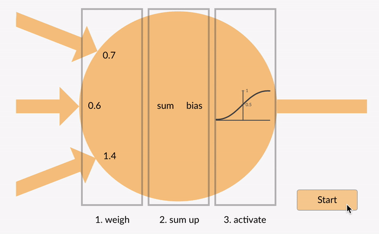

在利用MLP解决图像分类问题时，首先要将二维图像转换成一维向量，然后再对模型进行训练。这样做有两个缺点：（1）随着图像尺寸的增大，可训练参数的数量会急剧增加。（2）MLP会丢失图像的空间特征。空间特征指的是图像中像素的排列。

在所有这些神经网络中，存在一个共同问题：梯度消失与爆炸（Vanishing and Exploding Gradient）。此问题与反向传播（backpropagation）算法有关。反向传播算法通过寻找梯度来更新神经网络的权值。因此，在非常深的神经网络（具有大量隐藏层的网络）中，梯度会随着向后传播而消失或爆炸，从而导致梯度消失与爆炸（Vanishing and Exploding Gradient）。MLP无法捕获处理序列数据所需的输入数据中的顺序信息。

#### 循环神经网络（RNN）

MLP隐藏层上的环形约束转向RNN。RNN在隐藏状态上有一个循环连接，此循环约束能够确保在输入数据中捕捉到顺序信息。

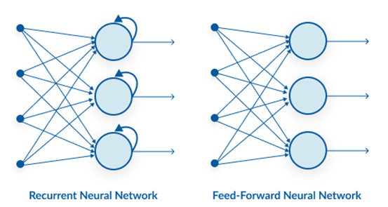

RNN能够捕捉数据中出现的顺序信息，例如，预测时文本中单词之间的依赖关系：每个时间步长的输出（o1, o2, o3, o4）不仅取决于当前单词，还取决于先前的单词。


RNN跨不同的时间步长共享参数。这通常被称为参数共享（Parameter Sharing）。这将减少训练参数并降低计算成本。如图所示，U、W、V 这3个权值矩阵是所有时间步长中共享的权值矩阵。

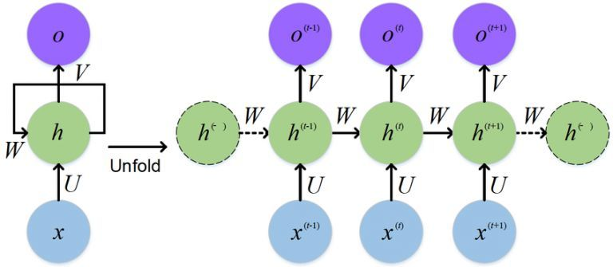

深度RNN（具有大量时间步长的RNN）也存在梯度消失和爆炸问题，这是在所有不同类型神经网络中常见的问题。如图所示，在最后一个时间步长处计算的梯度在到达初始时间步长时消失。

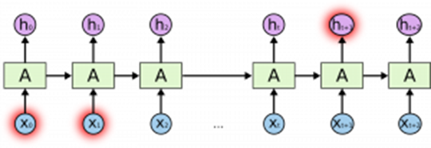

#### 卷积神经网络（CNN）

卷积神经网络（CNN）目前在深度学习领域非常热门。这些CNN模型被应用于不同的应用和领域，在图像和视频处理项目中尤其普遍。

CNN的构建块是过滤器，也就是内核。内核的作用是利用卷积运算从输入中提取相关特征。我们可以试着了解一下使用图像作为输入数据的过滤器的重要性。将图像与过滤器进行卷积会生成一个特征图（feature map）：


尽管引入卷积神经网络的初衷是要解决与图像数据相关的问题，但它们在顺序输入上的表现也十分出色。

CNN能够自动学习过滤器。这些过滤器有助于从输入数据中提取正确的相关特征。

CNN从图像中捕捉空间特征（spatial features）。空间特征指的是像素在图像中的排列以及它们之间的关系。它们能够帮助我们准确地识别物体、物体位置、以及它与图像中其他物体的关系。

#### 总结

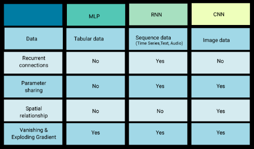

DNN指的是包含多个隐层的神经网络，如图1所示，根据神经元的特点，可以分为MLP、CNN、RNN等，下文在区分三者的时候，都从神经元的角度来讲解。MLP是最朴素的DNN，CNN是encode了空间相关性的DNN，RNN是encode进了时间相关性的DNN。


图1

MLP是最简单的DNN，它的每一层其实就是fc层（fully connected layer），其神经元见图2所示。

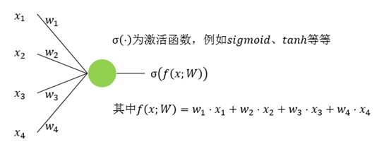

图2

CNN相对于MLP而言，多了一个先验知识，即数据之间存在空间相关性，比如图像，蓝天附近的像素点是白云的概率会大于是水桶的概率。滤波器会扫过整张图像，在扫的过程中，参数共享。图3、图4、图5、图6是一个3x3的输入经过一个2x2的conv的过程，该conv的stride为1，padding为0。图7是最后的计算结果。

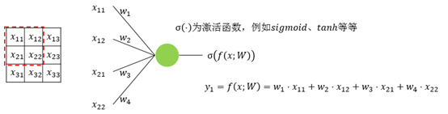

图3


图4

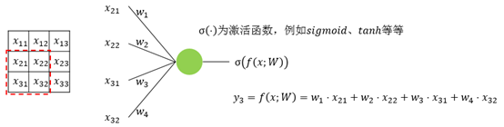

图5


图6


图7

RNN相对于MLP而言，也多了一个先验知识，即数据之间存在时间相关性，比如一段文字，前面的字是“上”，后面的字是“学”概率更大，是“狗”的概率很小。RNN神经元的输入会有多个time step，每个time step的输入进入神经元中时会共享参数。图8是一个典型的RNN示意图，图9是将图8在时间上展开的结果，这里只展开了两步。

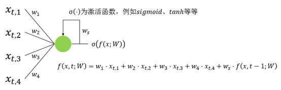

图8

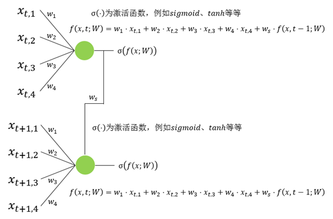

图9

#### 2.2 使用MNIST数据库

```Python
import numpy as np
from keras.datasets import mnist
import matplotlib.pyplot as plt
# load dataset
(x_train, y_train), (x_test, y_test) = mnist.load_data()
# count the number of unique train labels
unique, counts = np.unique(y_train, return_counts=True)
print("Train labels: ", dict(zip(unique, counts)))
# count the number of unique test labels
unique, counts = np.unique(y_test, return_counts=True)
print("Test labels: ", dict(zip(unique, counts)))
# sample 25 mnist digits from train dataset
indexes = np.random.randint(0, x_train.shape[0], size=25)
images = x_train[indexes]
labels = y_train[indexes]
# plot the 25 mnist digits
plt.figure(figsize=(5,5))
for i in range(len(indexes)):
     plt.subplot(5, 5, i + 1)
     image = images[i]
     plt.imshow(image, cmap='gray')
     plt.axis('off')
plt.show()
plt.savefig("mnist-samples.png")
plt.close('all')
```

MNIST数据是2D张量，需要根据输入类型进行reshaped。

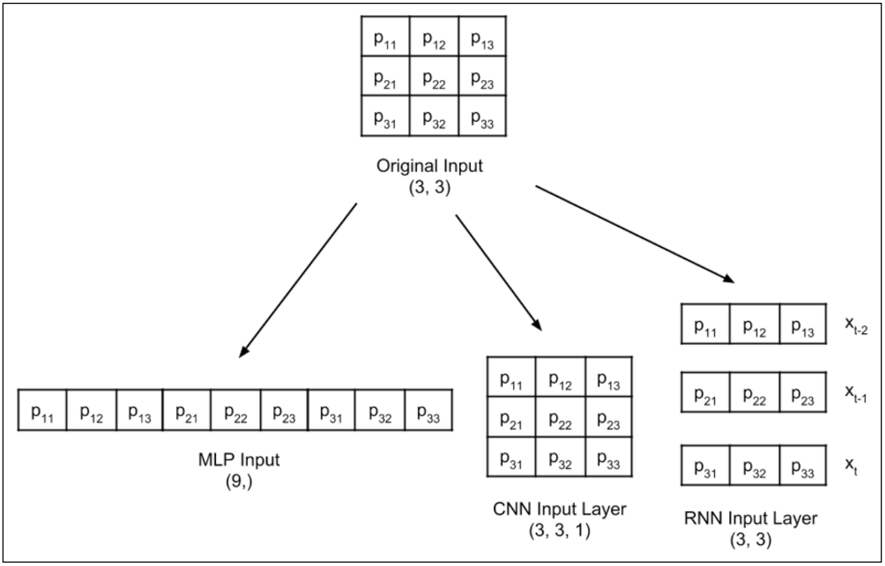

如图，3*3的数据被reshape成符合MLP、CNN、RNN要求的输入数据。

## 3. MLP分类器实现

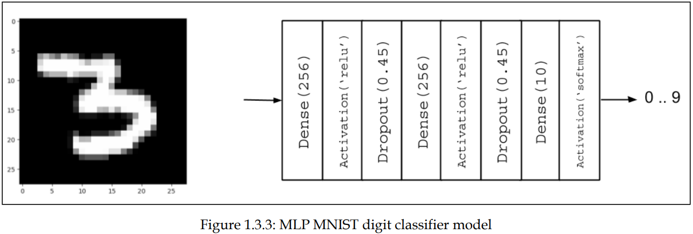

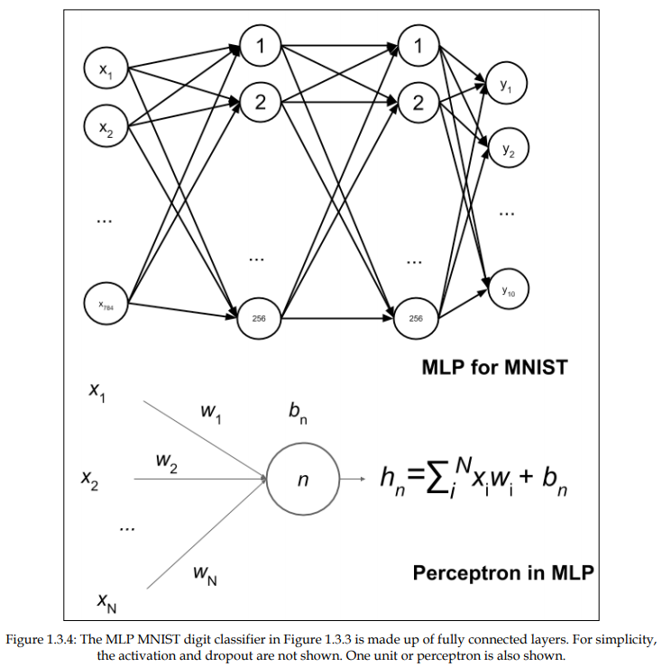

```Python
import numpy as np
from keras.models import Sequential
from keras.layers import Dense, Activation, Dropout
from keras.utils import to_categorical, plot_model
from keras.datasets import mnist
# load mnist dataset
(x_train, y_train), (x_test, y_test) = mnist.load_data()
# compute the number of labels 
num_labels = len(np.unique(y_train))
# convert to one-hot vector 转换
y_train = to_categorical(y_train)
y_test = to_categorical(y_test)
# image dimensions (assumed square)
image_size = x_train.shape[1]
input_size = image_size * image_size
# resize and normalize 在训练之前要进行reshape。
# 标准化，可以避免值梯度过大而增加训练难度
#  there is an option to put everything back to the integer pixel values by multiplying the output tensor by 255.
x_train = np.reshape(x_train, [-1, input_size])
x_train = x_train.astype('float32') / 255
x_test = np.reshape(x_test, [-1, input_size])
x_test = x_test.astype('float32') / 255
# network parameters
batch_size = 128
hidden_units = 256
dropout = 0.45
# model is a 3-layer MLP with ReLU and dropout after each layer
model = Sequential()
model.add(Dense(hidden_units, input_dim=input_size))
model.add(Activation('relu'))
model.add(Dropout(dropout))
model.add(Dense(hidden_units))
model.add(Activation('relu'))
model.add(Dropout(dropout))
model.add(Dense(num_labels))
# this is the output for one-hot vector
model.add(Activation('softmax'))
model.summary()
plot_model(model, to_file='mlp-mnist.png', show_shapes=True)
# loss function for one-hot vector
# use of adam optimizer
# accuracy is a good metric for classification tasks
model.compile(loss='categorical_crossentropy', optimizer='adam', metrics=['accuracy'])
# train the network
model.fit(x_train, y_train, epochs=20, batch_size=batch_size)
# validate the model on test dataset to determine generalization
loss, acc = model.evaluate(x_test, y_test, batch_size=batch_size)
print("\nTest accuracy: %.1f%%" % (100.0 * acc))
```

深度学习中，数据以张量的形式存储。0维张量是标量，1维张量是向量（矢量），2维张量是矩阵，还有多维张量。

由于Dense层是线性操作，一系列Dense层仅可逼近线性函数。在Dense层之间插入*relu*激活函数可以使MLP具有非线性映射功能。*relu*或**线性整流函数**（Rectified Linear Unit, **ReLU**），又称**修正线性单元，**是一种人工神经网络中常用的激活函数（activation function），通常指代以斜坡函数及其变种为代表的非线性函数。ReLU像一个过滤器，使正输入通过不发生改变，其他的归零。

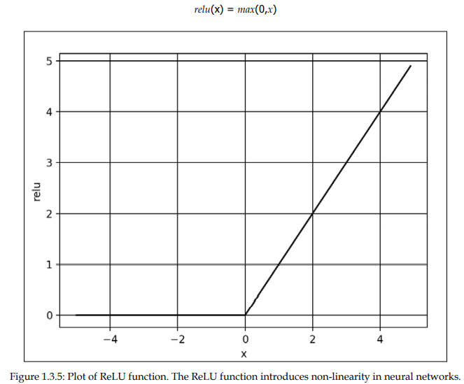

其他的非线性函数如：elu，selu，softplus，sigmoid，tanh等。然而，ReLU由于简便而在深度学习领域应用最广泛。

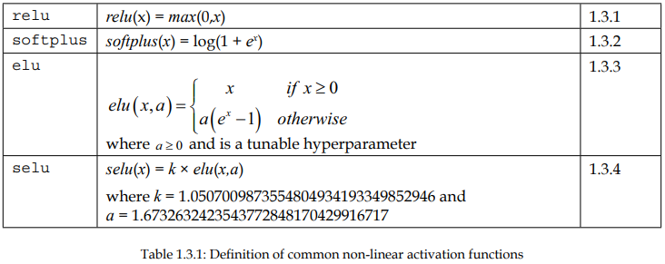

*Dropout*层是一种可以用于减少神经网络过拟合的结构。Dropout则是在每一个batch的训练当中随机减掉一些神经元。因为越大的神经网络就越有可能产生过拟合，因此随机删除一些神经元就可以防止其过拟合了，也就是让拟合的结果没那么准确。神经元个数较多，容易产生过拟合，因此将其加上dropout的结构，而后面神经元个数较少的地方就不用加了。

在机器学习中，我们非常关心模型的预测能力，即模型在新数据上的表现，而不希望过拟合现象的的发生，我们通常使用正则化（regularization）技术来防止过拟合情况。正则化是机器学习中通过显式的控制模型复杂度来避免模型过拟合、确保泛化能力的一种有效方式。如果将模型原始的假设空间比作“天空”，那么天空飞翔的“鸟”就是模型可能收敛到的一个个最优解。在施加了模型正则化后，就好比将原假设空间（“天空”）缩小到一定的空间范围（“笼子”），这样一来，可能得到的最优解能搜索的假设空间也变得相对有限。有限空间自然对应复杂度不太高的模型，也自然对应了有限的模型表达能力。这就是“正则化有效防止模型过拟合的”一种直观解析。

在深度学习中，用的比较多的正则化技术是L2正则化。L2约束通常对稀疏的有尖峰的权重向量施加大的惩罚，而偏好于均匀的参数。这样的效果是鼓励神经单元利用上层的所有输入，而不是部分输入。所以L2正则项加入之后，权重的绝对值大小就会整体倾向于减少，尤其不会出现特别大的值（比如噪声），即网络偏向于学习比较小的权重。所以L2正则化在深度学习中还有个名字叫做“权重衰减”（weight decay），也有一种理解这种衰减是对权值的一种惩罚，所以有些书里把L2正则化的这一项叫做惩罚项（penalty）。L1 正则化除了和L2正则化一样可以约束数量级外，L1正则化还能起到使参数更加稀疏的作用，稀疏化的结果使优化后的参数一部分为0，另一部分为非零实值。非零实值的那部分参数可起到选择重要参数或特征维度的作用，同时可起到去除噪声的效果。此外，L1正则化和L2正则化可以联合使用，这种形式也被称为“Elastic网络正则化”。

```python
from keras.regularizers import l2
model.add(Dense(hidden_units, kernel_regularizer=l2(0.001), input_dim=input_size))
```

输出层的激活函数采用*softmax*。

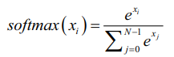

其他的输出层激活函数有：linear，sigmoid（logistic sigmoid），tanh。

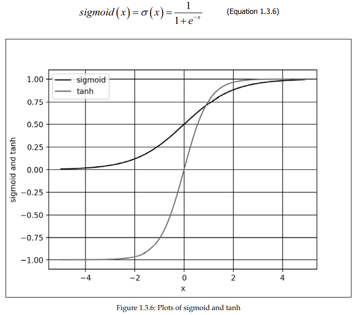

常用的损失函数之一是均方差*mean_squared_error，mse*，还有交叉熵损失函数categorical_crossentropy，mean_absolute_error, binary_crossentropy。For classification by category, categorical_crossentropy or mean_squared_error is a good choice after the softmax activation layer. The  binary_crossentropy loss function is normally used after the sigmoid activation  layer while mean_squared_error is an option for tanh output.

优化目标是最小化损失函数。Keras中默认的性能度量是损失（预测值和真实值之差）。在训练、验证、测试中，还可以将精度作为性能度量。

Keras中有几种优化器，最常用的有随机梯度下降Stochastic Gradient Descent (SGD), 自适应矩估计Adaptive Moments Estimation (Adam),  均方根传递Root Mean Squared Propagation (RMSprop)。每个优化器都有一些特征参数，如：学习率、矩momentum、衰减decay。Adam和RMSprop是具有自适应学习率的SGD。

指定了训练集、损失函数、优化器、正则方法后，就可以进行模型训练。

```python
# loss function for one-hot vector
# use of adam optimizer
# accuracy is a good metric for classification tasks
model.compile(loss='categorical_crossentropy', optimizer='adam', metrics=['accuracy'])
# train the network
model.fit(x_train, y_train, epochs=20, batch_size=batch_size)
```

仅需提供*x*和*y*数据、训练阶段数、抽样集大小，*fit()*就能完成剩下的工作。

下图为不同的MLP网络配置和性能评价：

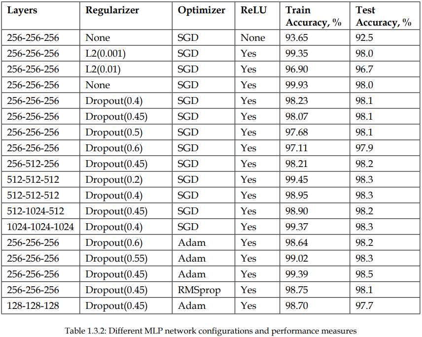

模型配置完毕后，可查看打印模型的参数：

```python
model.summary()
plot_model(model, to_file='mlp-mnist.png', show_shapes=True)
```

## 4. 卷积神经网络 Convolutional neural networks (CNNs)

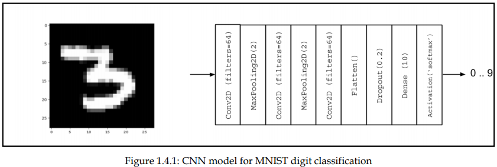

与MLP模型不同，输入张量增加了新的维度（高度、宽度、通道或（图像大小，图像大小，1）=（28,28,1））。并且需要调整训练和测试数据以适应输入类型。

```python
import numpy as np
from keras.models import Sequential
from keras.layers import Activation, Dense, Dropout
from keras.layers import Conv2D, MaxPooling2D, Flatten
from keras.utils import to_categorical, plot_model
from keras.datasets import mnist
# load mnist dataset
(x_train, y_train), (x_test, y_test) = mnist.load_data()
# compute the number of labels
num_labels = len(np.unique(y_train))
# convert to one-hot vector
y_train = to_categorical(y_train)
y_test = to_categorical(y_test)
# input image dimensions
image_size = x_train.shape[1]
# resize and normalize
x_train = np.reshape(x_train,[-1, image_size, image_size, 1])
x_test = np.reshape(x_test,[-1, image_size, image_size, 1])
x_train = x_train.astype('float32') / 255
x_test = x_test.astype('float32') / 255
# image is processed as is (square grayscale)
input_shape = (image_size, image_size, 1)
batch_size = 128
kernel_size = 3
pool_size = 2
filters = 64
dropout = 0.2
# model is a stack of CNN-ReLU-MaxPooling
model = Sequential()
model.add(Conv2D(filters=filters, kernel_size=kernel_size, activation='relu', input_shape=input_shape))
model.add(MaxPooling2D(pool_size))
model.add(Conv2D(filters=filters, kernel_size=kernel_size, activation='relu'))
model.add(MaxPooling2D(pool_size))
model.add(Conv2D(filters=filters, kernel_size=kernel_size, activation='relu'))
model.add(Flatten())
# dropout added as regularizer
model.add(Dropout(dropout))
# output layer is 10-dim one-hot vector
model.add(Dense(num_labels))
model.add(Activation('softmax'))
model.summary()
plot_model(model, to_file='cnn-mnist.png', show_shapes=True)
# loss function for one-hot vector
# use of adam optimizer
# accuracy is good metric for classification tasks
model.compile(loss='categorical_crossentropy', optimizer='adam', metrics=['accuracy'])
# train the network
model.fit(x_train, y_train, epochs=10, batch_size=batch_size)loss, acc = model.evaluate(x_test, y_test, batch_size=batch_size)
print("\nTest accuracy: %.1f%%" % (100.0 * acc))
```

主要的改变是采用*Convert2D*层。

采样数据归一化（Batch normalization）可以使CNN使用较大的学习率而不会导致训练的不稳定。

在MLP中，Dense层是标志性特征；在CNN中，卷积核的卷积操作是标志性特征。卷积层(Convolution Layer)通常用作对输入层输入数据进行特征提取，通过卷积核矩阵对原始数据中隐含关联性的一种抽象。卷积操作原理上其实是对两张像素矩阵进行点乘求和的数学操作，其中一个矩阵为输入的数据矩阵，另一个矩阵则为卷积核（滤波器或特征矩阵），求得的结果表示为原始图像中提取的特定局部特征。

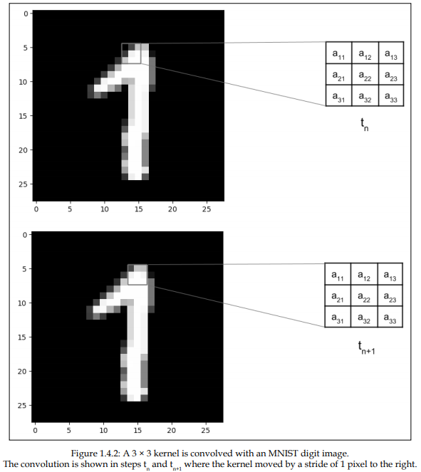


激活层(Activation Layer)负责对卷积层抽取的特征进行激活，由于卷积操作是由输入矩阵与卷积核矩阵进行相差的线性变化关系，需要激活层对其进行非线性的映射。激活层主要由激活函数组成，即在卷积层输出结果的基础上嵌套一个非线性函数，让输出的特征图具有非线性关系。卷积网络中通常采用ReLU来充当激活函数（还包括tanh和sigmoid等）ReLU的函数形式如公式所示，能够限制小于0的值为0,同时大于等于0的值保持不变。
$$
f(x)=\begin{cases}
   0 &\text{if } x<0 \\
   x &\text{if } x\ge 0
\end{cases}
$$
池化层又称为降采样层(Downsampling Layer)，作用是对感受域内的特征进行筛选，提取区域内最具代表性的特征，能够有效地降低输出特征尺度，进而减少模型所需要的参数量。按操作类型通常分为最大池化(Max Pooling)、平均池化(Average Pooling)和求和池化(Sum Pooling)，它们分别提取感受域内最大、平均与总和的特征值作为输出，最常用的是最大池化。

全连接层(Full Connected Layer)负责对卷积神经网络学习提取到的特征进行汇总，将多维的特征输入映射为二维的特征输出，高维表示样本批次，低位常常对应任务目标。

在卷积神经网络中，卷积常用来提取图像的特征，但不同层次的卷积操作提取到的特征类型是不相同的，特征类型粗分如表5.2所示。
​                                                                 表5.2 卷积提取的特征类型

| 卷积层次 | 特征类型 |
| :------: | :------: |
| 浅层卷积 | 边缘特征 |
| 中层卷积 | 局部特征 |
| 深层卷积 | 全局特征 |

图像与不同卷积核的卷积可以用来执行边缘检测、锐化和模糊等操作。表5.3显示了应用不同类型的卷积核（滤波器）后的各种卷积图像。

 表5.3 一些常见卷积核的作用

|         卷积作用         |                            卷积核                            |               卷积后图像                |
| :----------------------: | :----------------------------------------------------------: | :-------------------------------------: |
|         输出原图         | $\begin{bmatrix} 0 & 0 & 0 \\ 0 & 1 & 0 \\ 0 & 0 & 0 \end{bmatrix}$ |                   |
| 边缘检测（突出边缘差异） | $\begin{bmatrix} 1 & 0 & -1 \\ 0 & 0 & 0 \\ -1 & 0 & 1 \end{bmatrix}$ |      |
|  边缘检测（突出中间值）  | $\begin{bmatrix} -1 & -1 & -1 \\ -1 & 8 & -1 \\ -1 & -1 & -1 \end{bmatrix}$ |    |
|         图像锐化         | $\begin{bmatrix} 0 & -1 & 0 \\ -1 & 5 & -1 \\ 0 & -1 & 0 \end{bmatrix}$ |          |
|         方块模糊         | $\begin{bmatrix} 1 & 1 & 1 \\ 1 & 1 & 1 \\ 1 & 1 & 1 \end{bmatrix} \times \frac{1}{9}$ |             |
|         高斯模糊         | $\begin{bmatrix} 1 & 2 & 1 \\ 2 & 4 & 2 \\ 1 & 2 & 1 \end{bmatrix} \times \frac{1}{16}$ |  |

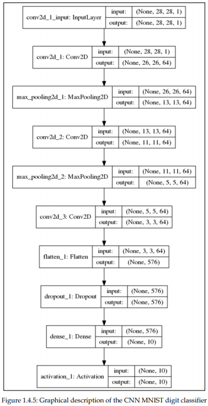

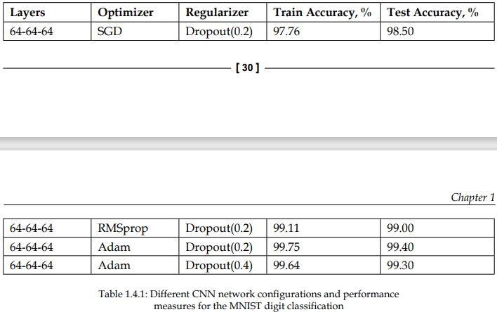

## 5. 循环神经网络(Recurrent neural networks, RNN)

时间序列数据是指在不同时间点上收集到的数据，这类数据反映了某一事物、现象等随时间的变化状态或程度。一般的神经网络，在训练数据足够、算法模型优越的情况下，给定特定的x，就能得到期望y。其一般处理单个的输入，前一个输入和后一个输入完全无关，但实际应用中，某些任务需要能够更好的处理序列的信息，即前面的输入和后面的输入是有关系的。比如：

​	当我们在理解一句话意思时，孤立的理解这句话的每个词不足以理解整体意思，我们通常需要处理这些词连接起来的整个序列； 当我们处理视频的时候，我们也不能只单独的去分析每一帧，而要分析这些帧连接起来的整个序列。为了解决一些这样类似的问题，能够更好的处理序列的信息，RNN就由此诞生了。

在进一步了解RNN之前，先给出最基本的单层网络结构，输入是`$x$`，经过变换`Wx+b`和激活函数`f`得到输出`y`：


​	在实际应用中，我们还会遇到很多序列形的数据，如：

- 自然语言处理问题。x1可以看做是第一个单词，x2可以看做是第二个单词，依次类推。

- 语音处理。此时，x1、x2、x3……是每帧的声音信号。

- 时间序列问题。例如每天的股票价格等等。

  其单个序列如下图所示：

  

  前面介绍了诸如此类的序列数据用原始的神经网络难以建模，基于此，RNN引入了隐状态$h$（hidden state），$h$可对序列数据提取特征，接着再转换为输出。

  为了便于理解，先计算$h_1$：

  

  注：图中的圆圈表示向量，箭头表示对向量做变换。

  RNN中，每个步骤使用的参数`$U,W,b$`​相同，`$h_2$`的计算方式和`$h_1$`类似，其计算结果如下：

  

  计算$h_3$,$h_4$也相似，可得：

  

  接下来，计算RNN的输出$y_1$，采用$Softmax$作为激活函数，根据$y_n=f(Wx+b)$，得$y_1$:

  

  使用和$y_1$相同的参数$V,c$，得到$y_1,y_2,y_3,y_4$的输出结构：

  

  以上即为最经典的RNN结构，其输入为$x_1,x_2,x_3,x_4$，输出为$y_1,y_2,y_3,y_4$，当然实际中最大值为$y_n$，这里为了便于理解和展示，只计算4个输入和输出。从以上结构可看出，RNN结构的输入和输出等长。

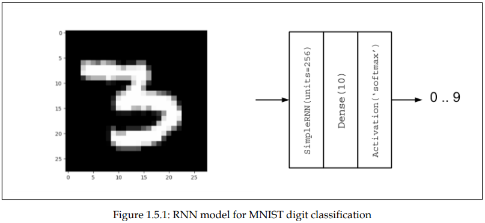

```python
import numpy as np
from keras.models import Sequential
from keras.layers import Dense, Activation, SimpleRNN
from keras.utils import to_categorical, plot_model
from keras.datasets import mnist
# load mnist dataset
(x_train, y_train), (x_test, y_test) = mnist.load_data()
 
# compute the number of labels
num_labels = len(np.unique(y_train))
# convert to one-hot vector
y_train = to_categorical(y_train)
y_test = to_categorical(y_test)
# resize and normalize
image_size = x_train.shape[1]
x_train = np.reshape(x_train,[-1, image_size, image_size])
x_test = np.reshape(x_test,[-1, image_size, image_size])
x_train = x_train.astype('float32') / 255
x_test = x_test.astype('float32') / 255
# network parameters
input_shape = (image_size, image_size)
batch_size = 128
units = 256
dropout = 0.2 
 
# model is RNN with 256 units, input is 28-dim vector 28 timesteps
model = Sequential()
model.add(SimpleRNN(units=units, dropout=dropout, input_shape=input_shape))
model.add(Dense(num_labels))
model.add(Activation('softmax'))
model.summary()
plot_model(model, to_file='rnn-mnist.png', show_shapes=True)
# loss function for one-hot vector
# use of sgd optimizer
# accuracy is good metric for classification tasks
model.compile(loss='categorical_crossentropy', optimizer='sgd', metrics=['accuracy'])
# train the network
model.fit(x_train, y_train, epochs=20, batch_size=batch_size)loss, acc = model.evaluate(x_test, y_test, batch_size=batch_size)
print("\nTest accuracy: %.1f%%" % (100.0 * acc))
```

RNN与之前两个模型的区别主要有两个方面。第一，输入类型为input_ shape = (timesteps, input_dim) 或 input_dim的序列（timesteps的维度数）。第二，采用具有units=256个单元的SimpleRNN层表示RNN神经元。units变量表示输出单元个数。CNN的标志特征是卷积核的卷积操作，RNN的输出不仅是输入的函数，还是之前输出或隐藏层输出的函数。由于之前的输出同样是再之前输出的函数，当前的输出同样是之前输出知道输入的函数。

在Keras中，SimpleRNN层是最简单的RNN。

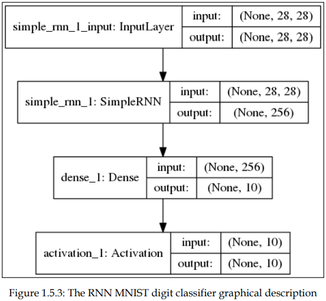

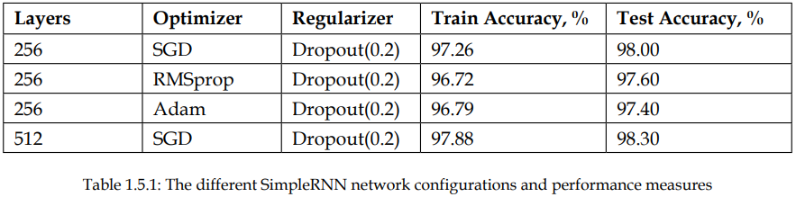

有一些RNN系列的深度神经网络得到了广泛应用。例如Long Short-Term Memory (LSTM)网络在机器翻译领域和智能问答领域得到了广泛应用。LSTM解决了长期依赖性问题，或记忆与当前输出相关的过去信息的问题。

与RNNs或SimpleRNN不同，LSTM神经元的内部结构更加复杂。

## 6. LSTM

### LSTM的产生原因

​	RNN在处理长期依赖（时间序列上距离较远的节点）时会遇到巨大的困难，因为计算距离较远的节点之间的联系时会涉及雅可比矩阵的多次相乘，会造成梯度消失或者梯度膨胀的现象。为了解决该问题，研究人员提出了许多解决办法，例如ESN（Echo State Network），增加有漏单元（Leaky Units）等等。其中最成功应用最广泛的就是门限RNN（Gated RNN），而LSTM就是门限RNN中最著名的一种。有漏单元通过设计连接间的权重系数，从而允许RNN累积距离较远节点间的长期联系；而门限RNN则泛化了这样的思想，允许在不同时刻改变该系数，且允许网络忘记当前已经累积的信息。

### 图解标准RNN和LSTM的区别

​	所有 RNN 都具有一种重复神经网络模块的链式的形式。在标准的 RNN 中，这个重复的模块只有一个非常简单的结构，例如一个 tanh 层，如下图所示：


​	LSTM 同样是这样的结构，但是重复的模块拥有一个不同的结构。不同于单一神经网络层，这里是有四个，以一种非常特殊的方式进行交互。


注：上图图标具体含义如下所示：


​	上图中，每一条黑线传输着一整个向量，从一个节点的输出到其他节点的输入。粉色的圈代表 pointwise 的操作，诸如向量的和，而黄色的矩阵就是学习到的神经网络层。合在一起的线表示向量的连接，分开的线表示内容被复制，然后分发到不同的位置。

### 6.11.3 LSTM核心思想图解

​	LSTM 的关键就是细胞状态，水平线在图上方贯穿运行。细胞状态类似于传送带。直接在整个链上运行，只有一些少量的线性交互。信息在上面流传保持不变会很容易。示意图如下所示：

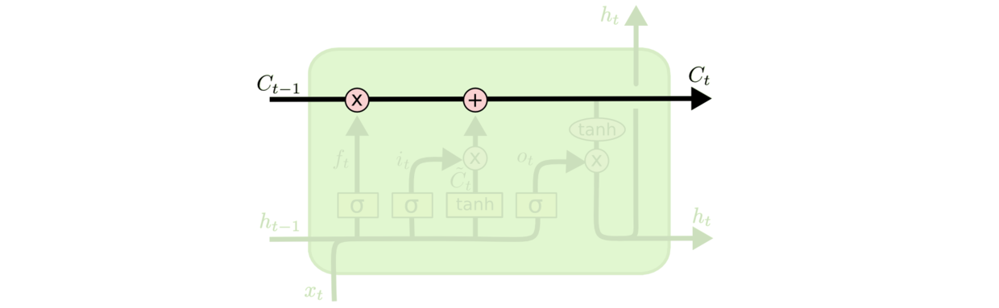

LSTM 有通过精心设计的称作为“门”的结构来去除或者增加信息到细胞状态的能力。门是一种让信息选择式通过的方法。他们包含一个 sigmoid 神经网络层和一个 pointwise 乘法操作。示意图如下：

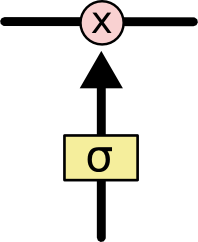


LSTM 拥有三个门，分别是忘记层门，输入层门和输出层门，来保护和控制细胞状态。

**忘记层门**

​	作用对象：细胞状态 。

​	作用：将细胞状态中的信息选择性的遗忘。

​	操作步骤：该门会读取$h_{t-1}$和$x_t$，输出一个在 0 到 1 之间的数值给每个在细胞状态$C_{t-1}$中的数字。1 表示“完全保留”，0 表示“完全舍弃”。示意图如下：


**输入层门**

​	作用对象：细胞状态 

​	作用：将新的信息选择性的记录到细胞状态中。

​	操作步骤：

​	步骤一，sigmoid 层称 “输入门层” 决定什么值我们将要更新。

​	步骤二，tanh 层创建一个新的候选值向量$\tilde{C}_t$加入到状态中。其示意图如下：

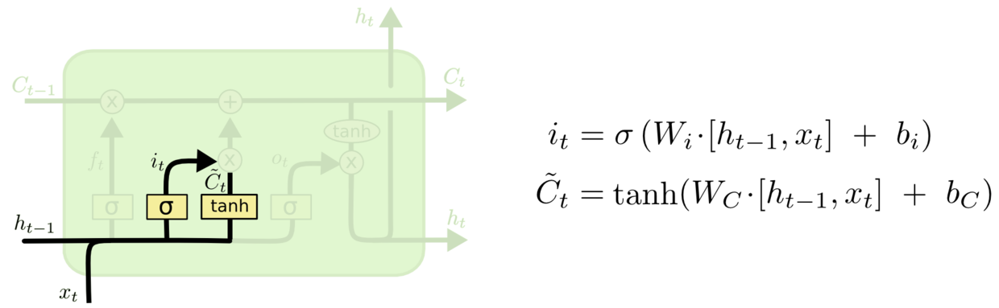

​	步骤三：将$c_{t-1}$更新为$c_{t}$。将旧状态与$f_t$相乘，丢弃掉我们确定需要丢弃的信息。接着加上$i_t * \tilde{C}_t$得到新的候选值，根据我们决定更新每个状态的程度进行变化。其示意图如下：

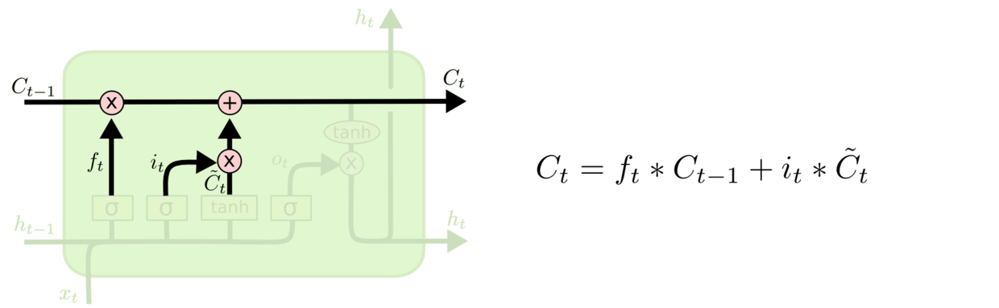

**输出层门** 
	作用对象：隐层$h_t$ 

​	作用：确定输出什么值。

​	操作步骤：

​	步骤一：通过sigmoid 层来确定细胞状态的哪个部分将输出。

​	步骤二：把细胞状态通过 tanh 进行处理，并将它和 sigmoid 门的输出相乘，最终我们仅仅会输出我们确定输出的那部分。

其示意图如下所示：

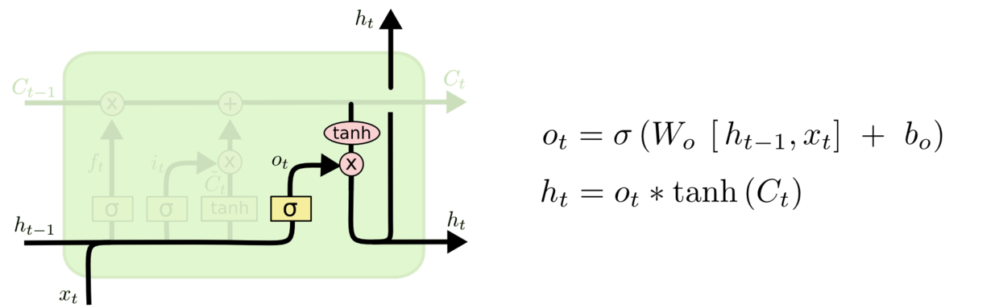

## LSTMs与GRUs的区别

LSTMs与GRUs的区别如图所示：

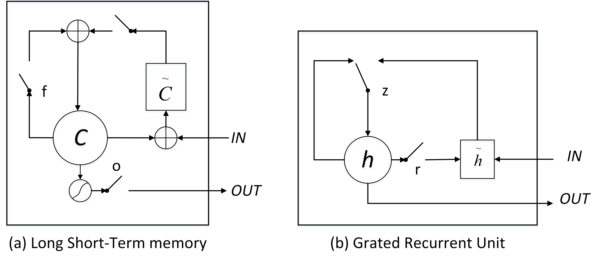

从上图可以看出，二者结构十分相似，**不同在于**：

1. new memory都是根据之前state及input进行计算，但是GRUs中有一个reset gate控制之前state的进入量，而在LSTMs里没有类似gate；
2. 产生新的state的方式不同，LSTMs有两个不同的gate，分别是forget gate (f gate)和input gate(i gate)，而GRUs只有一种update gate(z gate)；
3. LSTMs对新产生的state可以通过output gate(o gate)进行调节，而GRUs对输出无任何调节。

```python
import tensorflow.keras
from tensorflow.keras.models import Sequential
from tensorflow.keras.layers import InputLayer, Dense, SimpleRNN, Activation, Dropout, Conv1D
from tensorflow.keras.layers import Embedding, Flatten, LSTM, GRU

model.add(SimpleRNN(units=units, dropout=dropout, input_shape=input_shape))

model.add(LSTM(units=units, dropout=dropout, input_shape=input_shape))

model.add(GRU(units=units, dropout=dropout, input_shape=input_shape))
```

```python
def my_rnn(vocab_size, word_index, wordvector_dimension, learning_rate, hidden_units, sequence_length):
    model = Sequential()
    embedding_matrix = get_embedding_matrix(vocab_size, word_index, wordvector_dimension)
    model.add(Embedding(vocab_size, wordvector_dimension,  weights = [embedding_matrix], input_length= sequence_length, trainable= False, mask_zero= True))
    model.add(SimpleRNN(units= hidden_units, input_shape= [None, sequence_length], return_sequences= False))
    model.add(Dense(1, activation= 'sigmoid'))
    adam = tf.keras.optimizers.Adam(lr= learning_rate)
    model.compile(loss= 'binary_crossentropy', optimizer= adam, metrics= ['accuracy'])
    print(model.summary())
    return model

def my_lstm(vocab_size, word_index, wordvector_dimension, learning_rate, hidden_units, sequence_length):
    model = Sequential()
    embedding_matrix = get_embedding_matrix(vocab_size, word_index, wordvector_dimension)
    model.add(Embedding(vocab_size, wordvector_dimension, weights = [embedding_matrix], input_length= sequence_length, trainable= False, mask_zero= True))
    model.add(LSTM(units= hidden_units, input_shape= [None, sequence_length], return_sequences= False))
    model.add(Dense(1, activation= 'sigmoid'))
    adam = tf.keras.optimizers.Adam(lr= learning_rate)
    model.compile(loss= 'binary_crossentropy', optimizer= adam, metrics= ['accuracy'])
    print(model.summary())
    return model

def my_gru(vocab_size, word_index, wordvector_dimension, learning_rate, hidden_units, sequence_length):
    model = Sequential()
    embedding_matrix = get_embedding_matrix(vocab_size, word_index, wordvector_dimension)
    model.add(Embedding(vocab_size, wordvector_dimension,  weights = [embedding_matrix], input_length= sequence_length, trainable= False, mask_zero= True))
    model.add(GRU(units= hidden_units, input_shape= [None, sequence_length], return_sequences= False))
    model.add(Dense(1, activation= 'sigmoid'))
    adam = tf.keras.optimizers.Adam(lr= learning_rate)
    model.compile(loss= 'binary_crossentropy', optimizer= adam, metrics= ['accuracy'])
    print(model.summary())
    return model
```